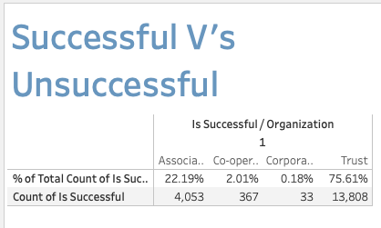
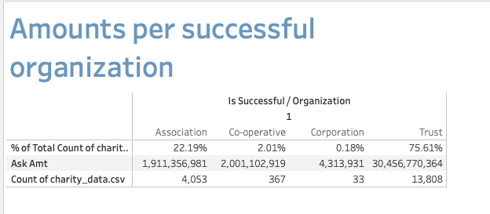
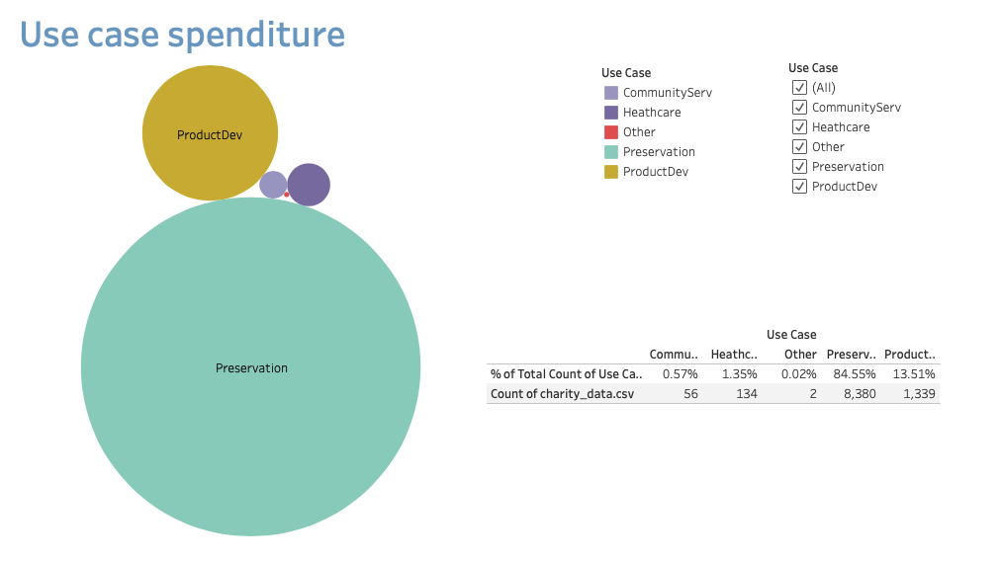
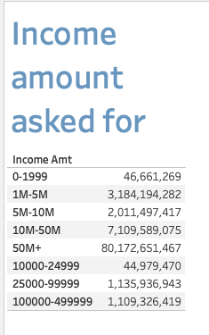

# Project 4 - group 1

## Project overview

Using a dataset solve, analyze, or visualize a problem using machine learning (ML) with the other technologies we’ve learned. Here are the specific requirements:

1) Find a problem worth solving, analyzing, or visualizing.

2) Use machine learning (ML) with the technologies we’ve learned.

3) You must use Scikit-learn and/or another machine learning library.

4) Your project must be powered by a dataset with at least 100 records.

5) You must use at least two of the following:

* Python Pandas
* Python Matplotlib
* HTML/CSS/Bootstrap
* JavaScript Plotly
* JavaScript Leaflet
* SQL Database
* MongoDB Database
* Google Cloud SQL
* Amazon AWS
* Tableau

## The data set

Using the following dataset charity_data, we will compare how effective machine learning is compared to other visualization tools.

## Project outline 

We will be focussing our findings on answering the following questions:

Tableau shows us that around 75-80% of campaigns were classified as successful, so how can machine learning make this % better?

Using Tableau what further analysis can we find. How do these findings compare to machine learning?

What will machine learning do to predict a successful campaign?

Can machine learning predict a higher success rate? If so then what does a successful campaigns need?

Is the succes rate prediction in machine learning the same as the data in Tableau?

## Data clean up

The data set contains over 34,000 rows of data and all rows contain the relevant information. The only initial clean up that was needed involved changing a those rows that contained the 'date' Jan-99 in the Income_Amt column. The data contained in this is a range of numerical data. So using Excel find and replace, Jan-99 was replaced with the income range 0-1999. Over 700 rows were amended.

## Analysis

[**Tableau dashboard story - HF**](https://public.tableau.com/app/profile/hayley.fuller/viz/Project4-Charitydata/Charitydataanalysis)

**Analysis of charity data using Tableau - HF/LR**

This dataset from Alphabet Soup contains 34, 299 applications. Of those applications the majority of campaigns were successful.

We looked at how the affiliation of a charity had an effect on the success rate of the campaign, and found that 71% of the successful campaigns were from independant affiliations, 28.5% were from Company Sponsored. FamilyParent and National Affiliations had a success rate of 0.2% and 0.1% respectively, with a negligible amount of successful campaigns from Regional or Other affiliations.

The successful campaigns are classified as a Trust. With 75.61% of overall successful applications. Compared to a Corporation which amounts to 0.18% of overall successful applications.

 

The amount asked for from these successful campaigns classified as a Trust organisations is 30, 456, 770, 364 that is 75.61% with only 13, 808 of the 34,299 applications.

 

The money is being used for preservation of the charity that is applying. This makes preservation the top reason for charity applications at 84.55%, with only 8,380 of the overall applications.

This dataset shows us the income amount of the charity. And the more successful applications are charities with an income of 25,000 to 99,999, with preservation as the reason.

Looking at the amount asked for in relation to the income amount we see that those with a higher income 50M+ ask for more compared to those with a lower income amount. This is not surprising as it is to be expected that those with a higher income need more to sustain their charity.

**Analysis of charity data using Machine Learning - AG**

WRITE FINDINGS HERE

**Graphs to analyse model effectiveness - JB**

In AlphabetSoupCharity_Plots.ipynb I used the provided 3 attempts for the model, the first was the initial model and the second and third were successive attempts to optimise and improve the model's effectiveness and accuracy.

I used MatPlotLib to create graphs for the accuracy and loss scores for each attempt on the model.

These graphs for the models' accuracy scores show us that the models are working as expected because the training and validation lines both show accuracy increasing over time.

The loss graphs for the 1st and 2nd attempts at the model show they are working as expected as the training and validation loss scores both decrease over time.
However, the graph for the 3rd attempt indicates that it may be ‘overfitting’, i.e. matching too closely to the training data, and failing to fit well to the additional, testing data.

## Supervised ML - Classification Report 
A Classification Report measures a model's quality of predictions using 3 metrics

1. Accuracy: how often the model is correct, the percentage of correctly predicted observations to the total number of observations for the entire dataset. How many Trues (TP +TN) over all outcomes (TP + TN) / (TP + TN + FP + FN).
The model was right/accurate 57% of the time.

2. Precision: percentage of correctly predicted positive observations to the total predicted positive observations. High precision relates to a low false positive rate, how many true positives I had over all positives: TP / (TP + FP).
Out of the 34,000+ organisations that received funding from Alphabet Soup over the years, 79% used the money effectively.

3. Recall: percentage of correctly predicted positive observations to all predicted observations for that class: TP / (TP + FN). .High recall correlates to a low false negative rate.
Of all the organisations that received funding the model correctly predicted 93% of the time which organisations didn’t use the money effectively; and out of all the organisations that actually used the money effectively, the model only predicted this outcome correctly for 25% of those organisations.

# ML Classification Report - Conclusion
a) According to the Classification Report results, the model was correct 57% of the time which is not very accurate. 
b) Recall is the most reliable metric to consider, as the model is able to correctly predict 93% of the time which organisations will fail to use the money effectively.

In order to improve the model Accuracy it would be recommended to:

I. Add more datapoints in order to improve the model accuracy, as well as to

II. Further Exploratory Data Analysis: 
E.g.: Avoid Class Imbalance (Oversampling vs Undersampling) in order to have a balanced dataset. For this dataset this analysis was done using the class_counts function, which showed that this dataset is slightly unbalanced as ~53% of organisations used the money effectively against ~47% that didn't.

III. Feature Engineering: 
Selecting the features that best capture the pattern in the dataset (give us the best correlation) in order to improve a model's quality of predictions, by using tools like Random Forest -helps selecting those columns that improve a model prediction-, or Gridsearch that gives the best combination of parameters.

**Overall conclusion is that for a campaign to be successful they need to have the following attributes…**

1.  Be independantly affiliated
2.	Have an income amount of 25,000 to 99,999
3.	Be needing the money to preserve the charity
4.	And be a Trust, rather than an Association, Corporation or Co-operative

## Limitations regarding the data set

1) This is existing data

2) There are no dates regarding when funding was granted
